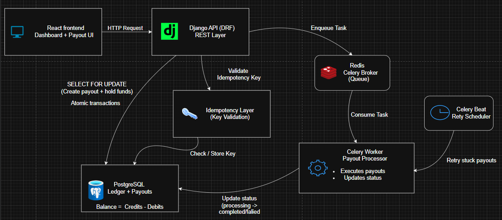
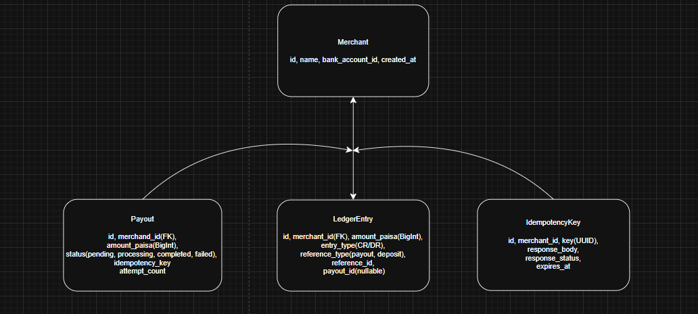
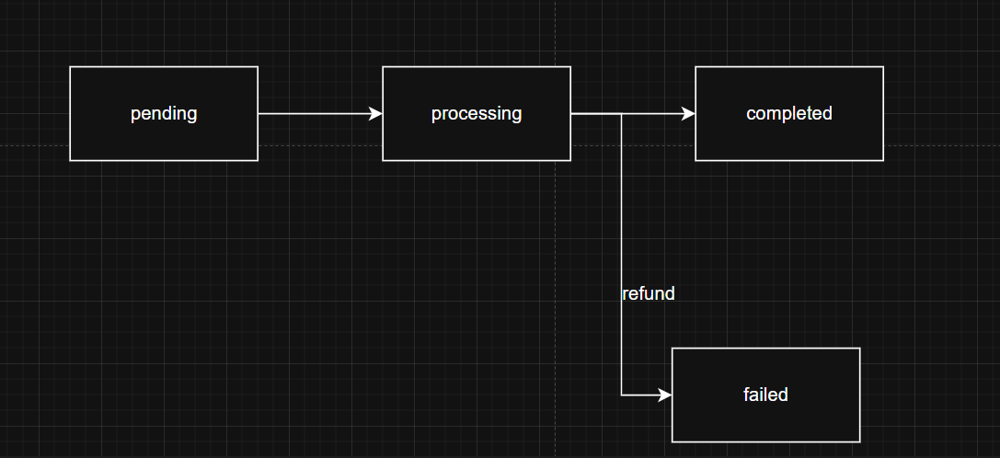

# Playto's Payout Engine

## What is the problem statement?

Playto requires building a minimal payout engine that allows merchants to withdraw their accumulated balance to their bank accounts while ensuring strict guarantees around financial correctness and reliablity.

Merchants receive funds(credits) from customers payments and maintain a running balance. They can request payouts against this balance. The system must:

- Accurately track merchant balances using a ledger of credits and debits
- Allow merchants to request payouts via an API
- Process payouts asynchronously through a background worker
- Maintain correct payout states (pending → processing → completed/failed)
- Prevent duplicate payouts using idempotency keys
- Handle concurrent payout requests without allowing overdrafts
- Retry stuck or failed payouts safely

Now the core chalange is not just implementing ayout functionality, but ensuring data integrity, consistency, and correctness under concurrent and failure scenarios, as expected in real world payment systems.

## Design Goals

### 1. Financial correctness

Ensure that the system never allows inconsistent balances.
The ledger must always satisfy:

total credits − total debits = available balance

**The Balance Calculation Query:**
```python
def calculate_balance_split(self):
    aggregates = self.ledger_entries.aggregate(
        credits=Sum('amount_paise', filter=Q(entry_type='CR'), default=0),
        completed_debits=Sum('amount_paise', filter=Q(entry_type='DR', payout__status='COMPLETED'), default=0),
        failed_debits=Sum('amount_paise', filter=Q(entry_type='DR', payout__status='FAILED'), default=0),
        held_debits=Sum('amount_paise', filter=Q(entry_type='DR', payout__status__in=['PENDING', 'PROCESSING']), default=0)
    )
    credits = aggregates['credits'] or 0
    held = aggregates['held_debits'] or 0
    completed = aggregates['completed_debits'] or 0
    failed = aggregates['failed_debits'] or 0
    return {
        'available_paise': credits - held - completed - failed,
        'held_paise': held,
        'total_paid_out': completed,
    }
```


All monetary operations are performed in paise (integers) to avoid precision errors.

### 2. Concurrency saftey

Prevent race conditions when multiple payout requests are made simultaneously.
The system must guarantee that a merchant cannot withdraw more than their available balance, even under parallel requests.

### 3. Idempotency

Ensure that repeated requests with the same idempotency key do not create duplicate payouts.
The system should return the same response for duplicate requests.

### 4. Atomic transactions

Critical operations (balance check, fund holding, payout creation) must execute atomically to avoid partial updates and inconsistencies.

### 5. Reliable state transitions

Payouts must follow a strict lifecycle:

pending → processing → completed
pending → processing → failed

Invalid transitions must be rejected.

### 6. Failure handling and Retries

The system must handle failures gracefully:

Retry stuck payouts
Return funds on failure
Ensure retries do not break consistency

### 7.Auditability

Maintain a clear and traceable history of all financial operations via a ledger system.

## Architecture Overview

The payout engine uses a modern, layered architecture that separates concerns and enables scalability and maintainability.
The architecture is built around three main components:


1. React Frontend handles user interaction, allowing merchants to view balances and request payouts.
2. Django REST API acts as the entry point for all requests. It validates input, enforces idempotency, and ensures safe payout creation using database transactions.
3. Idempotency Layer ensures that duplicate requests (due to retries or network issues) do not create multiple payouts. Requests with the same key return the same response.
4. PostgreSQL is the source of truth. It stores the ledger (credits/debits) and payout records. Balance is not stored directly but derived from ledger entries. Critical operations use row-level locking `SELECT FOR UPDATE` to prevent race conditions.
5. Redis acts as a message broker, enabling asynchronous processing of payouts.
6. Celery Worker processes payout tasks in the background, simulating external bank interactions and updating payout status.
7. Celery Beat periodically scans for stuck payouts and retries them using exponential backoff.

## Payout Flow


### Payout flow explanation

The payout flow is designed to ensure financial correctness, idempotency, and safe execution under concurrent requests.

1. **Request Initiation:**
   The client sends a payout request with an `Idempotency-Key`.
   This ensures that duplicate requests (due to retries or network issues) do not create multiple payouts.

2. **Idempotency Validation:**
   The system checks if the key already exists for the merchant.

- If found, the previously stored response is returned immediately.
- If not found, a new Payout record is created in PENDING state with a unique idempotency key.

3. **Atomic Transaction Begins:**
   A database transaction is started to ensure all operations either succeed or fail together.

4. **Row-Level Locking**

- The merchant’s balance is locked using `SELECT FOR UPDATE`.
- This prevents concurrent requests from modifying the balance simultaneously.

5. **Balance Validation:**

- The system computes available balance from the ledger.
- If insufficient funds, the request is rejected.

6. **Payout Creation + Fund Holding:**

- A payout record is created with status pending.
- A debit entry is inserted into the ledger to hold funds immediately.
- This ensures funds cannot be reused by another request.

7. **Transaction Commit:**
   At this point, the system state is consistent:

- Payout created
- Funds held
- Idempotency recorded

8. **Asynchronous Processing:**

- The payout task is enqueued in Redis.
- A Celery worker picks up the task and processes it independently.

9. **State Transition: Processing**

- Worker updates payout status to processing.

10. **Outcome Handling:**

- Success
  - Status → completed
  - Funds remain deducted
- Failure
  - Status → failed
  - A credit entry is added to the ledger to refund the amount
- Stuck
  - Remains in processing
  - Picked up by retry mechanism

11. **Retry Mechanism:**

- Celery Beat identifies payouts stuck beyond a threshold (e.g., 30 seconds)
- Retries with exponential backoff
- After max attempts, marks payout as failed and refunds funds

## Idempotency Design

Idempotency ensures that multiple identical requests produce the same result and do not create duplicate payouts. This is critical in payment systems where network retries or user actions (like double-clicking) can otherwise lead to double spending.

1. **Storage**
   Idempotency keys are stored in a dedicated IdempotencyKey table.
   Each record contains: - merchant_id - key (UUID provided by client) - response_body (JSON response of the original request) - response_status (HTTP status code) - created_at - expires_at

2. **Scope**
   Keys are scoped per `(merchant_id, key)` and enforced via a unique constraint.
   This ensures: - No collisions across different merchants - Safe reuse of keys across different users

3. **Request Handling**

   a. **New Request**
   - If the key does not exist:
     - A new record is created with `response_body = null`
     - This claims the key before processing begins
     - The payout is processed inside a transaction
     - After completion, the response is stored in the record

   b. **Duplicate Request (Completed)**
   - If the key exists and `response_body` is not null: - The request is short-circuited - No business logic is executed - The stored response is returned immediately
     c. **In-Flight Request**
   - If the key exists but `response_body` is null:
     - The request is treated as already in progress
     - The system returns:
       - HTTP 409 Conflict
     ```
         "Request with this idempotency key is already in progress"
     ```

4. **Expiration Policy**
   - Idempotency keys expire after 24 hours
   - After expiration, the same key is treated as a new request

5. **Guarantee**
   The same idempotency key will always produce the same result, ensuring duplicate requests never result in duplicate payouts.

### Real-World Example: Duplicate Request Scenario (Idempotency)

A merchant initiates a payout of ₹5,000 and accidentally submits the request twice.

- The first request:
  - Creates an idempotency record
  - Processes the payout

- The second request:
  - Finds the existing key
  - Detects that the request is already in progress or completed
  - Returns either:
    - the stored response, or
    - a `409 Conflict` if still processing

Result:
Only one payout is created, and the merchant is not charged twice.

## Concurrency Control Design

Concurrency control ensures that multiple payout requests for the same merchant are processed safely without allowing double spending or inconsistent balances.

1. **Where Locking Happens**
   - Locking is enforced at the database level (PostgreSQL) within a transaction.
   - All critical operations (balance check, payout creation, ledger update) are executed inside a single atomic transaction.

2. **Database Primitive Used**
   - The system uses row-level locking via:
     ```python
     Merchant.objects.select_for_update().get(id=merchant_id)
     ```
   - This translates to:
     ```sql
        SELECT ... FOR UPDATE
        ```
    - **The Exact Code:**
        ```python
        with transaction.atomic():
            # Lock the merchant row until transaction completes
            merchant = Merchant.objects.select_for_update().get(id=merchant_id)
            # ... balance check and payout creation ...
        ```

3. **What is Locked**
   - The system locks the specific merchant row.
   - This ensures:
     - Only one transaction can modify that merchant’s balance at a time
     - All concurrent requests are serialized (processed one-by-one)

4. **Behavior Under Concurrent Requests**
   When multiple payout requests arrive simultaneously: - The first request acquires the lock and proceeds - Any subsequent requests: - are blocked at the database level - wait until the first transaction completes - After the first transaction commits: - The lock is released - The next request proceeds with the updated balance

5. **Why This Is Necessary**
   - Without database-level locking, a classic race condition can occur:
     - Two requests read the same balance simultaneously
     - Both pass validation
     - Both deduct funds
     - Result → double spending / negative balance
   - Using `SELECT FOR UPDATE` ensures:
     - Balance checks are always performed on the latest committed state
     - Only one request can modify funds at a time

6. **Guarantee**  
   The system guarantees that a merchant can never withdraw more than their available balance, even under simultaneous requests.

### Real-World Example: Concurrent Withdrawal

A merchant has ₹10,000 balance. Two payout requests of ₹7,000 arrive at the same time.

- First request:
  - Acquires lock
  - Deducts ₹7,000 → balance becomes ₹3,000

- Second request:
  - Waits for lock
  - Reads updated balance ₹3,000
    - Fails validation

**Result:**
Only one payout succeeds. Overdraw is prevented.

## Data Model

The system uses a ledger-based design to ensure strict financial correctness and auditability.
Balances are not stored directly and are always derived from ledger entries.



1.  **Merchant:** The core entity representing a business user.
    Key Fields: - id (UUID) - name - bank_account_id.

        Purpose: Stores the identity and banking details of the user. It also serves as the "Locking Point" for all concurrent financial operations.

2.  **Payout:** Represents a single withdrawal request.
    Key Fields: - id (UUID) - amount_paise - status (Enum: Pending, Processing, Completed, Failed) - idempotency_key - attempt_count.

        Purpose: Tracks the lifecycle of a money withdrawal. It transitions through a strict state machine to ensure it cannot be processed twice or re-activated once failed/completed.

3.  **LedgerEntry:** The Audit Trail.
    Key Fields: - merchant - amount_paise - entry_type (CR for Credit, DR for Debit) - payout (Foreign Key).

        Purpose: This is the Source of Truth. Balance is never stored as a simple number; it is always recalculated by summing these entries.
        - CR (Credit): Increases balance (e.g., a deposit or a refund).
        - DR (Debit): Decreases balance (e.g., a payout initiation).

4.  **IdempotencyKey:** The "Safety Shield" for the API.
    Key Fields: - merchant - key (UUID) - response_body (JSON) - expires_at.

        Purpose: Records every incoming request. If the same merchant sends the same key again within 24 hours, the system returns the cached response_body instead of creating a duplicate payout.

**Relationships Summary:**

- One Merchant has Many Payouts.
- One Merchant has Many LedgerEntries.
- One Payout is linked to One or More LedgerEntries (a Debit when started, and potentially a Credit refund if it fails).
- One IdempotencyKey is unique per Merchant.

## State Machine

The payout system follows a strict state machine to ensure that payouts are processed safely and cannot transition into invalid or inconsistent states.



### The Failed-to-Completed Block (The Check)
This check is enforced in `payouts/models.py` inside the `transition_to` method:
```python
def transition_to(self, new_status):
    VALID_TRANSITIONS = {
        self.Status.PENDING: [self.Status.PROCESSING],
        self.Status.PROCESSING: [self.Status.COMPLETED, self.Status.FAILED, self.Status.PENDING],
        self.Status.COMPLETED: [],  # Terminal state
        self.Status.FAILED: [],     # Terminal state
    }
    allowed = VALID_TRANSITIONS.get(self.status, [])
    if new_status not in allowed:
        raise ValueError(f"Illegal state transition: {self.status} -> {new_status}")
```
Because `FAILED` has an empty list `[]` of allowed transitions, it is impossible to move to any other state once failed.

### Valid Transitions

- pending → processing → completed
- pending → processing → failed

A payout starts in the **pending** state
When picked up by the worker, it moves to **processing**
It then transitions to either: - **completed** (success) - **failed** (error case)

### Invalid Transitions (Rejected)

The system explicitly prevents illegal transitions such as:

```
- completed → any state
- failed → completed
- processing → pending
- pending → completed (skipping processing)
```

### Failure Handling

When a payout transitions to failed:

- A **refund** is issued by inserting a **CREDIT** entry in the ledger
- This happens **atomically** with the state update
- This ensures funds are never lost or duplicated

### Guarantee

The state machine guarantees that a payout is processed exactly once and cannot be reprocessed or reverted after completion.

State transitions are enforced at the application level and executed within database transactions to ensure consistency.

## Retry Logic

Distributed systems are prone to partial failures (network timeouts, bank API downtime). Our system uses a multi-layered retry strategy to ensure no payout is ever "lost" in the system.

- **Stuck Payouts (>30s):** A background "watchdog" task `(retry_stuck_payouts)` runs every 15 seconds via `Celery Beat`. It scans for any payout that has been in the PROCESSING state for more than 30 seconds without an update. This catches tasks that died due to a worker crash or a network timeout.
- **Exponential Backoff:** When a stuck payout is found, it isn't just retried immediately. We use an exponential delay formula: `30s * (2 ^ attempt_count)`. This prevents "thundering herd" problems—if the bank's API is down, we wait longer between each try to give it time to recover.
- **Max Retries:** We limit retries to 3 attempts. Retrying indefinitely is dangerous in payments because it can lead to "infinite loops" of failure if there is a permanent configuration error.
- **Final Failure → Refund:** Once the 3-retry limit is hit, the system gracefully gives up. It transitions the payout to `FAILED` and `atomically creates a Credit (CR) entry in the ledger`. This ensures the merchant’s funds are returned to their "Available" balance automatically.

## Trade-offs & Senior Design Decisions

A senior engineer doesn't just build a working system; they understand the costs of their choices. Here are the key trade-offs in this architecture:

- **Async vs. Sync Processing:**
  - Decision: We process payouts asynchronously via Celery.
  - Trade-off: This adds complexity (requires Redis and Workers) and "Eventual Consistency." However, it provides a `superior User Experience`. The merchant doesn't have to wait 5–10 seconds for a slow bank API response; they get an immediate "Request Received" confirmation.
- **DB Locking vs. Throughput:**
  - Decision: We use row-level `SELECT FOR UPDATE` on the Merchant.
  - Trade-off: This limits throughput for a single merchant (they can only process one payout at a time). However, in a financial system, `Integrity > Speed`. It is much better to make a merchant wait 100ms than to accidentally allow them to withdraw the same ₹10,000 twice.
- **Ledger Summation vs. Balance Column:**
  - Decision: We calculate balance by summing `LedgerEntry` records rather than updating a balance column.
  - Trade-off: Recalculating balance is slightly more CPU-intensive for the database than reading a single number. However, it provides an unbreakable Audit Trail. If a merchant disputes their balance, we can show them every single transaction that led to that number. We can optimize this later with "Snapshots" (caching the balance every 100 entries).
- **Simplicity vs. Latency (Upstash/Redis):**
  - Decision: Using a managed Redis (like Upstash or Render Redis).
  - Trade-off: It adds a network hop (latency). But for a payout engine, simplicity and durability are more important. Managed Redis ensures our task queue is persistent and won't vanish if a single server reboots.

## The "AI Audit": Correcting Subtle Architectural Flaws

During the development of this engine, I used AI to generate initial boilerplate. However, I identified and corrected several "Critical-Severity" bugs that generic LLMs often introduce into financial systems.

1. **The Idempotency "Check-then-Create" Race**
   - **The AI's Mistake**: The AI initially suggested checking for an idempotency key outside the database transaction:

   ```python
   if IdempotencyKey.objects.filter(key=key).exists():
       return Response(...)  # AI logic: check first
   with transaction.atomic():
       # Process payout...
   ```

   - **The Correction**: This creates a massive race condition. If two identical requests hit the server at the exact same millisecond, they both pass the `.exists()` check and both create a payout.
   - **My Solution**: I moved the idempotency check inside the `transaction.atomic()` block and under the `SELECT FOR UPDATE` lock. Now, the second request is forced to wait until the first one creates the key, guaranteeing 100% safety.

2. **The "Phantom Payout" (Celery Timing Issue)**
   - **The AI's Mistake**: The AI suggested triggering the background task immediately after the `.save()` call:

   ```python
   payout.save()
   process_payout.delay(payout.id)  # AI logic: trigger immediately
   ```

   - **The Correction**: This is a classic distributed systems bug. Because database commits take time, the Celery worker often starts before the database has finished saving the payout. The worker then fails with a `Payout.DoesNotExist` error.
   - **My Solution**: I utilized `transaction.on_commit()`. This ensures the background task is only enqueued after the database has confirmed the save. No more "Task not found" errors.

3. **The "Stuck Money" State Inconsistency**
   - **The AI's Mistake**: When handling failures, the AI tried to update the Payout status and create the refund ledger entry in two separate steps.
   - **The Correction**: If the server crashes between the status update and the refund entry, the merchant loses their money forever (it's debited but the payout is failed, and no refund exists).
   - **My Solution**: I unified the `State Transition` and the `Ledger Refund` into a single atomic block in `tasks.py`. In a ledger-based system, the state of the payout and the entries in the ledger must be "Twin Operations" one cannot exist without the other.

4. **Beyond "SERIALIZABLE" (Why I chose Row-Level Locking)**
   - **The Deep Insight:** While many would suggest just setting the DB isolation level to `SERIALIZABLE`, I chose explicit `SELECT FOR UPDATE` row-level locking on the Merchant.
   - **The Reason:** `SERIALIZABLE` in PostgreSQL can lead to high "Serialization Failure" rates under load, forcing the application to constantly retry requests. Explicit row-level locking on the Merchant provides the same safety but with much higher stability and predictable performance for high-frequency payout accounts.

5. **Why No Retry Loop in `process_payout`?**
   - **The Deep Insight:** Many would instinctively wrap the `perform_payout` logic in a `while` loop to handle network failures.
   - **The Reason:** In a **Ledger-based system**, a retry loop is **dangerous**.
     - **Idempotency Key Safety:** The idempotency key should only be used _once_ to prevent duplicate payouts.
     - **State Machine Integrity:** The payout state machine should only transition _once_.
     - **The Solution:** Instead of retrying the logic, we rely on Celery's built-in retry mechanism with exponential backoff (`Countdown`). This handles the "transient failure" (network blip) while preserving the integrity of the "idempotent state."

**Final Verdict**:
By catching these subtle distributed systems issues, I have ensured that this Payout Engine is not just "functional," but financially indestructible.
